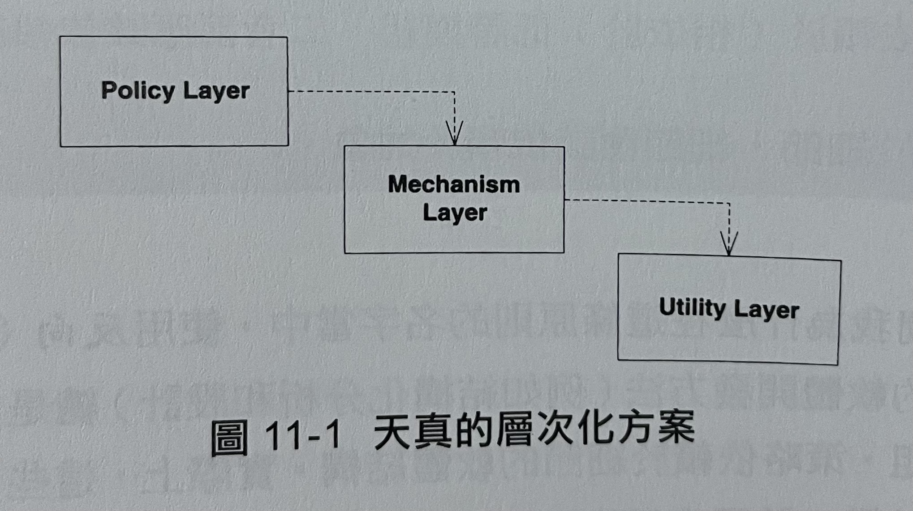
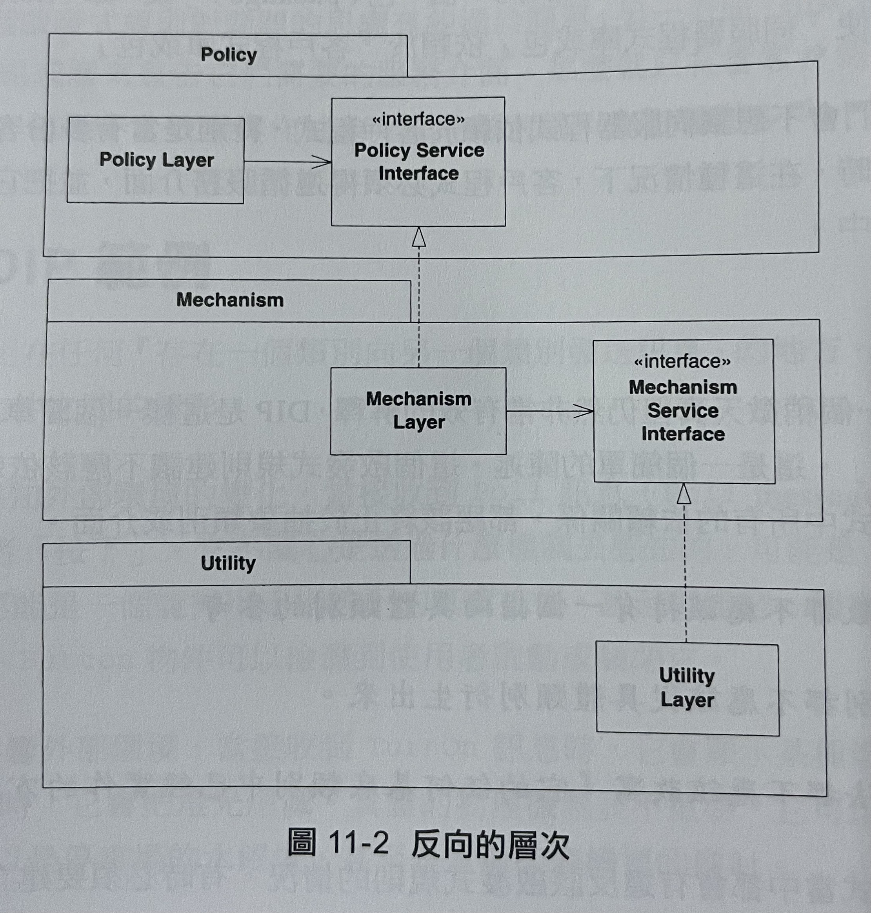
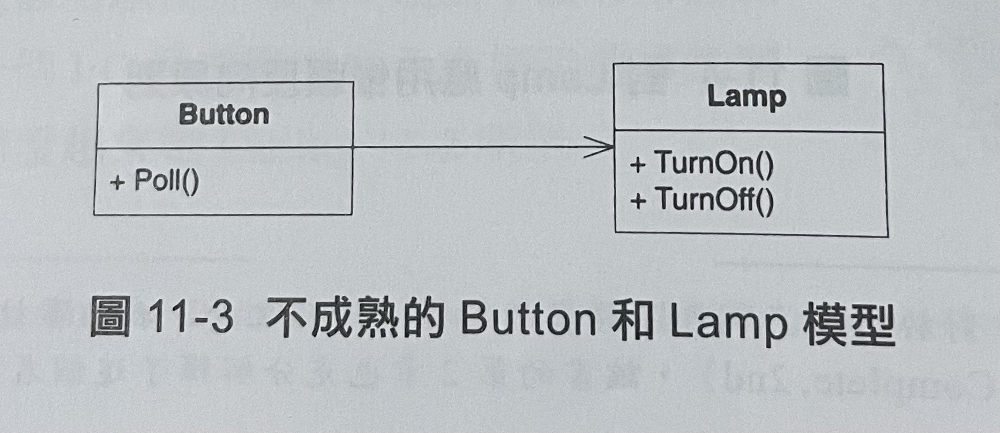
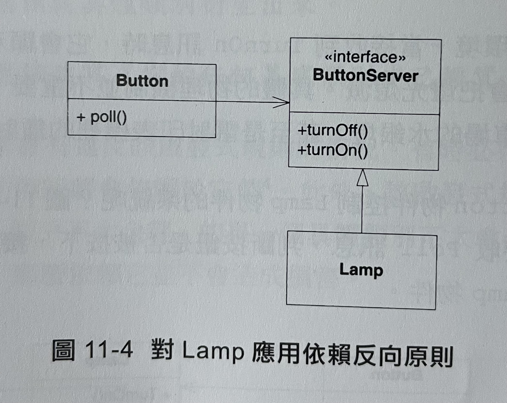
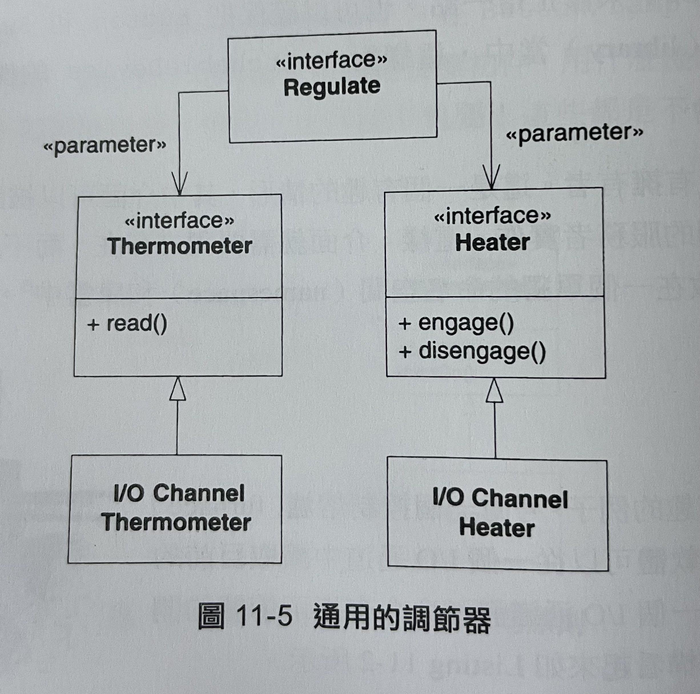

DIP (The Dependency-Inversion Principle) : 依賴反式原則
======
> 高層模組不應該依賴於(相依於)低層模組。二者都應該依賴於抽象
> 抽象不應該依賴於細節，細節應該依賴於抽象。

* 一個設計良好的物件導向程式，相對於傳統程式設計而言，其依賴的結構是"被反向"的。
* 我們希望能重複使用的是高層的設定策略模組，我們已經非常擅長透過副程式庫的方式來重複使用低層模組。如果高層模組依賴於低層模組，那麼不同的上下文中重複使用高層模組就變得非常困難。
* 如果高層模組獨立於低層模組，那麼高層模組就可以容易被重複使用，這個就是框架設計(framework design)的核心原則。

## 1. 層次化 (Layering)

1. 圖11-1，高層的Policy曾使用了低層的Mechanism層，而Mechanism層又使用更細節的Utility層。看起來似乎正確，但它存在"依賴關係是遞移的"。


2. 圖11-2，展示一個更適合的模型，每個交高層次都為他所需要的服務宣告一個抽象介面。較低的層次實現了這些抽象介面。每個高層類別都透過該抽象介面來使用下一層。這樣高層就不會依賴於低層，低層反而依賴於高層中宣告的抽象服務介面。


3. 反向介面所有權
* 這裡的反向，不僅僅是依賴關係的反向。它也是介面所有權的反向。客戶擁有抽象介面，而它們的服務者則從這些抽象介面衍生。
* Hollywood原則 - Don't call us, we'll call you.
 => 低層模組實作了"在高層模組中宣告並被高層模組呼叫的介面"

4. 依賴於抽象
* 任何變數都不應該持有一個指向具體類別的參考
* 任何類別都不應該從具體類別衍生出來
* 任何方法都不應該改寫"它的任何基底類別中已經實作的方法"


## 2. 簡單的DIP範例

依賴反向可應用在任何"存在一個類別向另一個類別發送訊息"的地方。例如，Button物件和Lamp物件之間的情形。


Listing 11-1 Button.cs

```csharp
public class Button
{
    private Lamp lamp;
    public void Poll()
    {
        if ( /* 一些條件 */)
            lamp.TurnOn();
    }
}
```

1. 找出潛在的抽象
什麼是高層策略?它是應用背後的抽象，是那些不隨具體細節改變的真理。
它是系統內部的系統 - 它是隱喻 (metaphore)


* 圖11-4中設計可使Button控制那些願意實作ButtonServer介面的任何設備。這賦予我們極大靈活性，同時也意味著，Button物件將能控制還沒有被創造出來的物件。


## 3. 熔爐案例

* 一個控制熔爐(furnace)調節器的軟體，該軟體可以從一個I/O通道中讀取目前的溫度，並透過向另一個I/O通道發命令來指示熔爐的開或關。演算法如Listing 11-2

Listing 11-2 溫度調節器的簡單演算法

```csharp
const byte TERMOMETER = 0X86;
const byte FURNACE = 0X87;
const byte ENGAGE = 1;
const byte DISENGAGE = 0;

void Regulate (double minTemp, double maxTemp)
{
    for(;;)
    {
        while (in(TERMOMETER) > minTemp)
            wait(1);
        out(FURNACE, ENGAGE);

        while (in(TERMOMETER) < maxTemp)
            wait(1);
        out(FURNACE, DISENGAGE);
    }
}
```

* 演算法高層意圖清楚，但實現的程式碼中卻夾雜許多低層細節。這段程式碼根本不能重複使用在不同的控制硬體。我們寧可將這種依賴關係反向，如圖11-5。


* 這就將依賴關係反向了。使得高層的調節策略不在依賴於任何溫度計或熔爐的特定細節。此演算法有更好的在使用性。

Listing 11-3 通用的調節器

```csharp
void Regulate (Thermometer t, Heater h, double minTemp, double maxTemp)
{
    for(;;)
    {
        while (t.Read() > minTemp)
            wait(1);
        h.Engage();

        while (t.Read() < maxTemp)
            wait(1);
        h.Disengage();
    }
}
```

## 4. 總結

1. 物件導向的程式設計反向了依賴式結構，使得"細節和策略都依賴於抽象"，並且通常是"客戶程式擁有服務介面"
2. 物件導向設計 => 程式的依賴關係是反向的; 程序化設計 => 程式的依賴關係不是反向。
3. 依賴反向原則是其用來實現基本低層的機制，正確應用於建立可重複使用的框架。
4. 由於抽象和細節隔離，所以程式碼也非常容易維護。