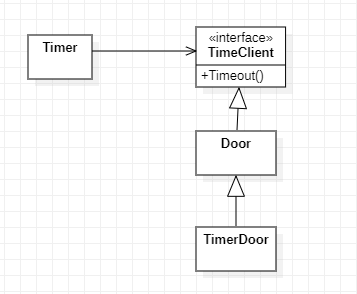
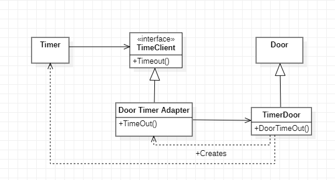
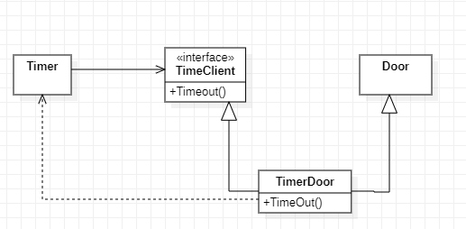
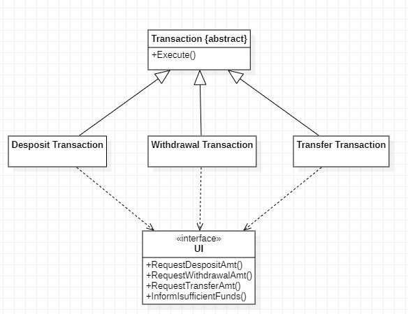
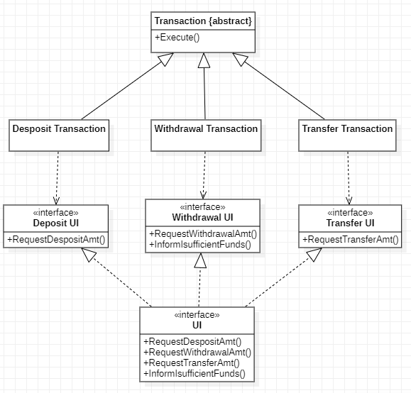

ISP (Interface Segregation Principle) 介面隔離原則
======
> 這個原則是用來處理"胖"介面存在的缺點。如果類別的介面不是內聚的，就代表該類別具有"胖"介面。
> 建議採用多個**具有內聚介面的抽象基底類別**取代一個存在非內聚的介面

## 1. 介面汙染
> 指的是介面被它自身所不需要的方法所污染了，導致必須要引入或實做某些與必需的工作不相關的內容。



```csharp
public class Timer
{
    public void Register(int timeout, TimeClient client)
    {
        /***********
        Operation
        ***********/
    }
}

public interface TimeClinet
{
    void TimeOut();
}

```

* 如上例可以看出，因Door繼承了TimeClient，而TimeDoor繼承了Door，故TimeDoor也具備了TimeClient的功能。

* 現在Door類別依賴於TimeClient了，但並非所有種類的Door都需要定時功能，顧這些Door的衍生類別，就必須要提供TimeOut方法的退化實作，如此就違反了ISP。
>ISP:介面隔離原則: 不應該強迫客戶程式依賴他們未使用的方法。

* 使用Door衍生類別的應用程式即便不使用TimeClient類別的定義，也必須引入(import)它。這樣就具有"不必要的複雜性" & "不必要的重複" 兩種臭味。

## 2. 分離客戶就是分離介面

```csharp
public class Timer
{
    public void Register(int timeout,int timeOutId,TimeClient client)
    {
        /***********
        Operation
        ***********/
    }
}

public interface TimeClient
{
    void TimeOut(int timeOutId);
}
```

* 對於TimeClient的使用者會受到影響，但此修正還會同不影響到Door及其所有的客戶程式，這是僵化性和粘滯性的臭味

* 使用ID的Timer類別，加入timeOutID 可能影響到那些不需要定時功能的Door衍生類別的客戶程式，導致需要去修改那些不需要用到的功能。

* 透過介面隔離，盡量避免不相干的類別間互相影響導致的耦合。


## 3.類別介面與物件介面

* 當兩個介面的功能需要操作同樣的資料，使之必須在同一個物件中實作，如何才能遵循ISP呢? 如何分離必須再一起實作的介面呢?
* **[Anser]** 一個物件的客戶不必透過該物件的介面去存取它，也可以透過委託或透過該物件的基底類別去存取它。

### 使用委託來分離介面



```csharp
public interface TimedDoor : Door
{
    void DoorTimeOut(int timeOutId);
}

public class DoorTimerAdapter : TimeClient
{
    private TimedDoor timedDoor;

    public DoorTimerAdapter(TimedDoor theDoor)
    {
        timedDoor = theDoor;
    }
    public virtual void TimeOut(int timeOutId)
    {
        timedDoor.DoorTimeOut(timeOutId)
    }
}
```

### 使用多重繼承來分離介面



```csharp
public interface TimedDoor : Door, TimeClient
{
    
}
```
* 通常多重繼承是比較常用的解決方案，只有當DoorTimerAdapter物件所做的轉換是必要的，或者不同時候需要不同的轉換實，才會選擇透過委託的方式處理


## 4.使用者介面的例子
* 可以把每個"atm可執行的不同事物"封裝為Transaction類別的衍生類別。每個類別都會呼叫 UI的方法，此為實踐ISP必須避免的情形。
  * 每項事務所使用的UI方法，其他操作類都不會使用到。
  * 對任何一個Transaction 衍生類別的變動，都會導致對於UI類別的變動，並同時影響到其他所有的Transaction 衍生類別，產生僵化性、脆弱性的臭味。
  * 因所有的Transaction衍生類別都依賴於UI介面，故所有的衍生類別都需要重新的建置，導致因不相關的修改，連帶造成不必要的變更動作，產生了黏滯性的臭味。



* 將介面分解成單獨的功能介面，避免不適當的耦合，最終的UI介面可以透過多重繼承去繼承這些單獨的介面。



* 在每次建立一個Transaction的新衍生類別時，抽象介面就需要一個相對應的基底類別，雖然UI介面及其衍生的類別都需要變更，但這些類別並沒有廣泛的被使用，所以增加新的UI基底類別所帶來的影響可減至最小。

```csharp
public interface Transaction
{
    void Execute();
}

public interface DepositUI
{
    void RequestDepositAmount();
}

public class DepositTransaction : Transaction
{
    private DepositUI depositUI;

    public DepositTransaction(DepositUI ui)
    {
        depositUI = ui;
    }

    public virtual void Execute()
    {
        depositUI.RequestDepositAmount();
    }
}

public interface WithdrawalUI
{
    void RequestWithdrawalAmount();
}

public class WithdrawalTransaction : Transaction
{
    private WithdrawalUI withdrawalUI;

    public  WithdrawalTransaction(WithdrawalUI ui)
    {
        withdrawalUI = ui;
    }

    public virtual void Execute()
    {
        depositUI.RequestWithdrawalAmount();
    }
}

public interface TransferUI
{
    void RequestTransferAmount();
}

public class TransferTransaction : Transaction
{
    private TransferUI TransferUI;

    public  TransferTransaction(TransferUI ui)
    {
        TransferUI = ui;
    }

    public virtual void Execute()
    {
        depositUI.RequestTransferAmount();
    }
}


public interface UI : DepositUI,WithdrawalUI,TransferUI
{
    
}
```

* 有一個可能的作法是把所有的UI元件放在同一個類別中，但這意味著當一個模組使用了任何一個UI介面，那麼該模組就會地移的依賴於所有的UI介面，而正式ISP警告所必須要避免的。

```csharp
public class UIGlobals
{
    public static WithdrawalUI withdrawalUI;
    public static TransferUI TransferUI;
    public static DepositUI depositUI;

    static UIGlobals()
    {
        UI Lui = new AtmUI();
        UIGlobals.withdrawalUI = Lui;
        UIGlobals.TransferUI = Lui;
        UIGlobals.depositUI = Lui;
    }
}

```

* 於此例衍生的新增函式，通常對於傳入函式的參數 **多個優於傳入單個**。
	* 若傳入單個參數，會迫使函式依賴於UI中的每一個介面。
	* 未來有可能需要對UI介面做功能拆分，此時就不需要再處理傳入單個參數所造成的問題。

```csharp
// 單個參數
void g (UI ui);

// 多個參數
void g (DepositUI depositUI,TransferUI TransferUI);
```


## 5.總結

* 胖類別會導致他們的客戶程式之間，產生不正常且有害的耦合。
* 客戶程式應該僅僅依賴於他們實際呼叫的方法，而通過將該胖類別分解為多個特定於客戶程式的介面，可以實現這個目標。
* 每個特定於客戶程式的介面僅僅宣告他的特定客戶或客戶組呼叫的那些函式。
* 透過將胖類別繼承於所有特定於客戶程式的介面，並實作他們，如此即可以解除客戶程式和他們並未呼叫的方法之間的依賴，並使得客戶程式之間互不依賴。


