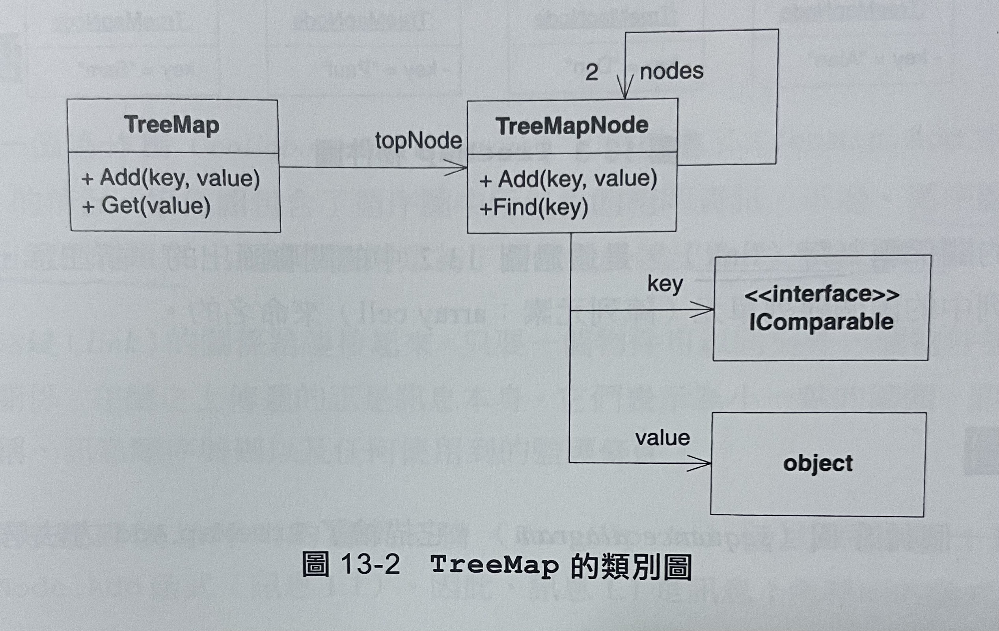
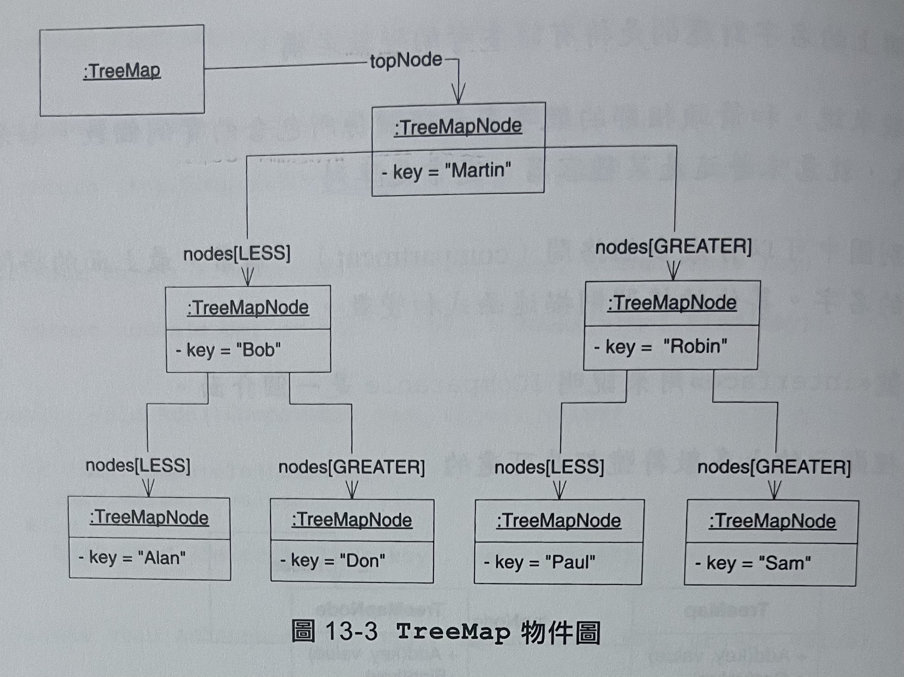
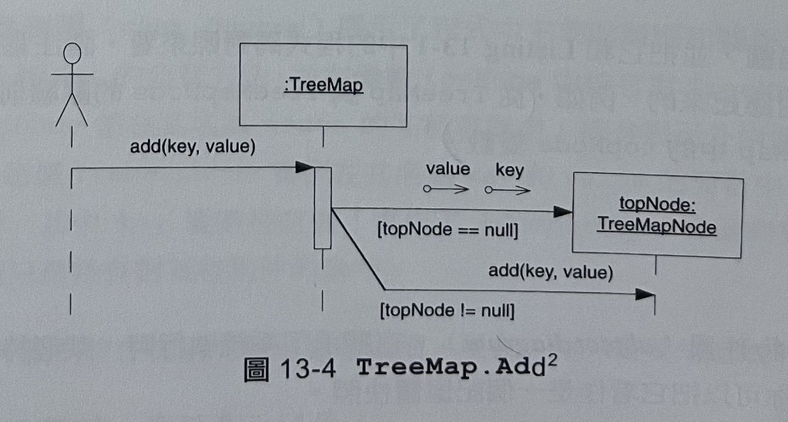
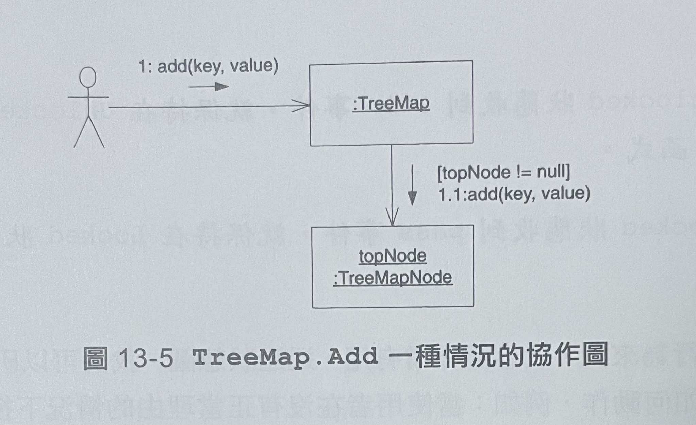
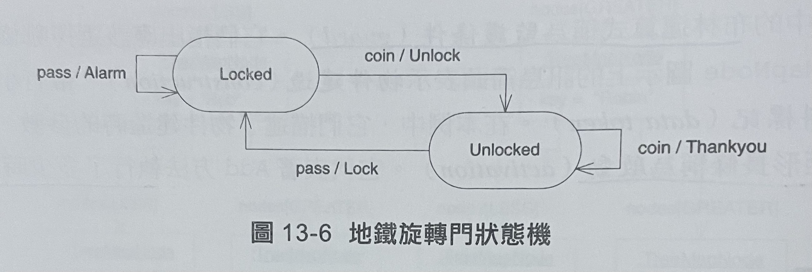

UML概述
======
> 統一塑模語言 Unified Modeling Language 是用來繪製軟體概念圖的一種圖形符號

### 分為三個層次的模型
1. 概念層級 (conceptual)
 - 一種速記方法，和原始碼沒有強烈關係，繪製存在人類問題的概念與抽象。
2. 規格說明層級 (spectification)
 - 目的是為了能夠將之轉換為原始程式碼 
3. 實作層級 (implementation)
 - 為了描繪已有的原始程式碼

### UML包含3種主要的圖示
1. 靜態圖 (static diagram)
 - 描述了類別、物件、資料結構及它們之間的關係，展現軟體元素間不變的邏輯結構
2. 動態圖 (dynamic diagram)
 - 展現軟體實體在執行過程中是如何變化的，描述執行流程或實體改變狀態的方式
3. 實體圖 (physical diagram)
 - 展示了軟體實體不變的物理結構，描述如原始檔、程式庫、二進位檔、資料檔等物理實體(physical entities)及它們的關係

Listing 13-1 TreeMap.cs 實現一個簡單二元數演算法的映射(Map)資料結構

```csharp
using System;

namespace TreeMap
{
	public class TreeMap
	{
		private TreeMapNode topNode = null;

		public void Add(IComparable Key, object value)
		{
			if (topNode == null)
				topNode = new TreeMapNode(key, value);
			else
				topNode.Add(key, value);
		}

		public void Get(IComparable Key)
		{
			return topNode == null ? null : topNode.Find(key);
		}
	}

	internal class TreeMapNode
	{
		private static readonly int LESS = 0;
		private static readonly int GREATER = 1;
		private IComparable key;
		private object value;
		private TreeMapNode[] nodes = new TreeMapNode[2];
		
		public TreeMapNode(IComparable key, object value)
		{
			this.key;
			this.value;
		}

		public object Find(IComparable key)
		{
			if (key.CompareTo(this.key) == 0) return value;
			return FindSubNodeForKey(SelectSubNode(key), key);
		}

		private int SelectSubNode(IComparable key)
		{
			return (key.CompareTo(this.key) < 0) ? LESS : GREATER;
		}

		private int FindSubNodeForKey(int node, IComparable key)
		{
			return nodes[node] == null ? null : nodes[node].Find(key);
		}

		public void Add(IComparable key, object value)
		{
			if (key.CompareTo(this.key) == 0)
				this.value = value;
			else
				AddSubNode(SelectSubNode(key), key, value);		
		}

		public void AddSubNode(int node, IComparable key, object value)
		{
			if (nodes[node] == null)
				nodes[node] == new TreeMapNode(key, value);
			else
				nodes[node].Add(key, value);		
		}
	}
}
```

## 1. 類別圖 (class diagram)
- 展示了程式中主要的類別和關係
- 和箭頭相鄰的字數表示包含的實例個數，意味著某種容器，通常是陣列。

- 所有關係都是關聯(association)關係。關聯是簡單的資料關係，其中一個物件"持有對另一個物件的參考"或"呼叫了其方法"

## 2. 物件圖 (object diagram)
- 展示了系統執行時，某個特定時刻的一種物件和關係。可以把它看作是一個記憶體快照。

- key變數的物件之間的關係稱為鏈(link)，鏈是針對nodes陣列中的兩個陣列單元(array cell)來命名。

## 3. 循序圖 (sequence diagram)
- 為了清楚地表達出訊息的順序

- 描繪了TreeMap.Add方法是如何實作的
- 方括號[]當中為布林函式稱為監護條件(guard)
- 終結在TreeMapNode圖示上的訊息箭頭表示物件建造(construction)
- 小圓圈箭頭稱為資料標記(data token)
- 窄矩形長條稱會啟動(activation)，代表Add方法執行了多少時間

## 4. 協作圖 (collaboration diagram)
- 為了清楚地表達物件之間的關係

- 小箭頭表示在鏈上傳遞的訊息
- 帶點的順序號碼表示呼叫的層次結構。TreeMap.Add(1)呼叫了TreeMapNode.Add函式(1.1)

## 5. 狀態圖 (state diagram)
- 對於理解系統的行為非常有用
- 可以研究系統在未預料到的情況下，該如何動作。
能夠全面地表達有限狀態機(finite state machine: FSM)

- 有兩個狀態(status): Locked、Unlocked
- 可以向機器發送兩個事件(event)，coin事件代表使用者已經向旋轉門投入一個硬幣;pass事件代表使用者已經通過旋轉門

## 5. 總結
- 本章節的圖示對於大多數的場合來說已經足夠了。
- 大多數程式設計師了解這麼多的UML知識就足以應付實際的工作需求。