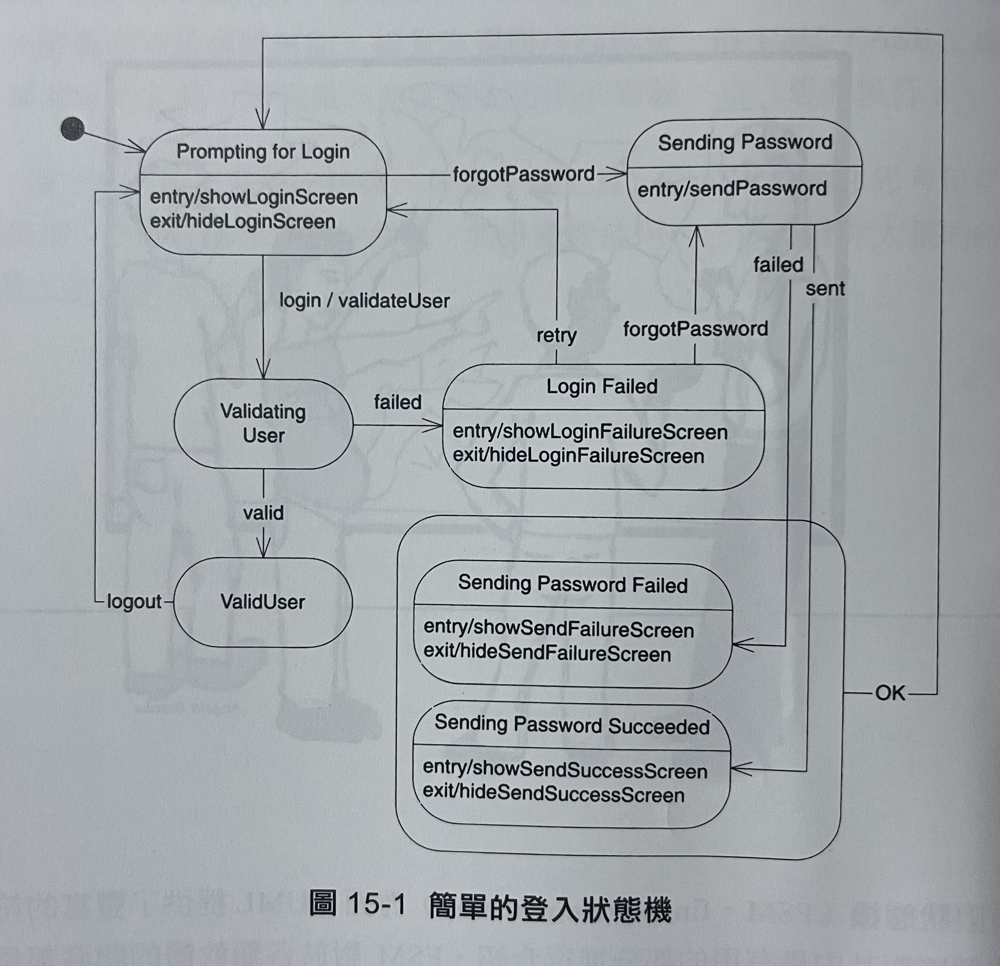
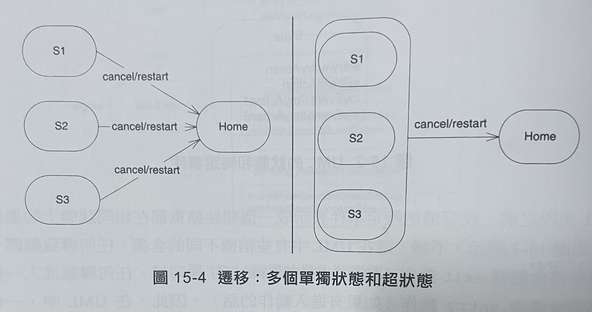
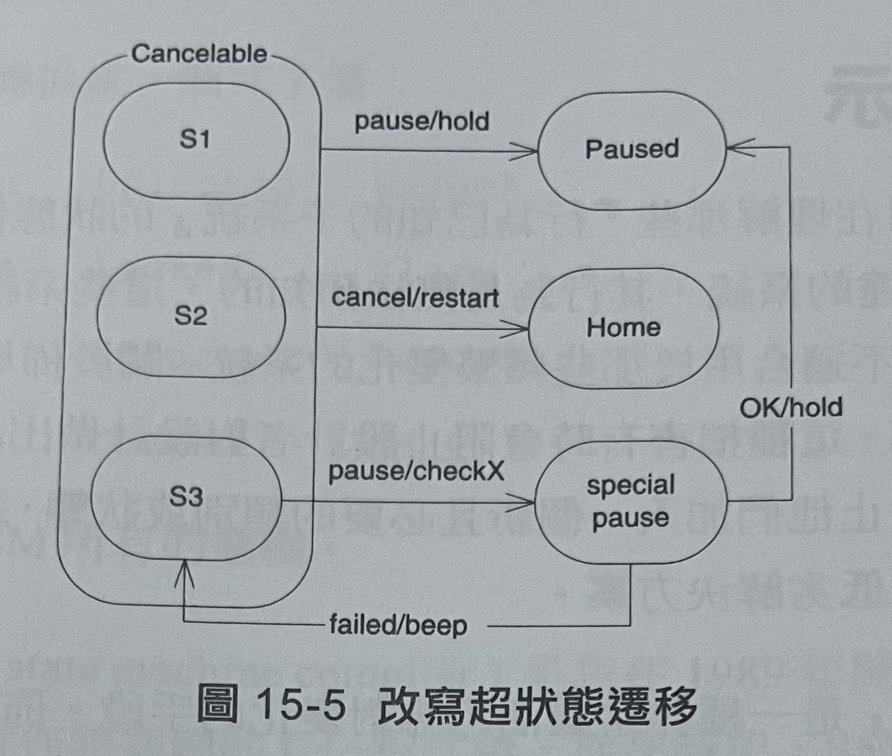
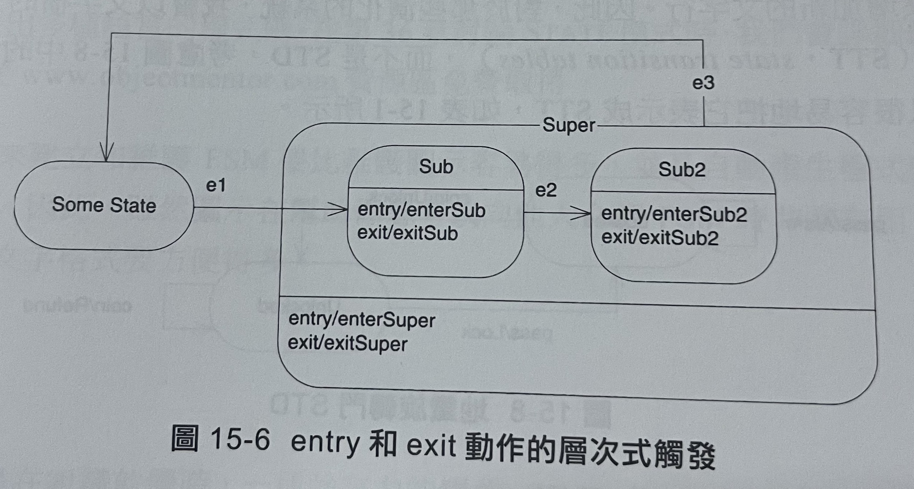
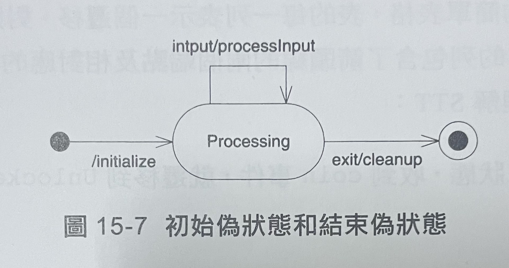
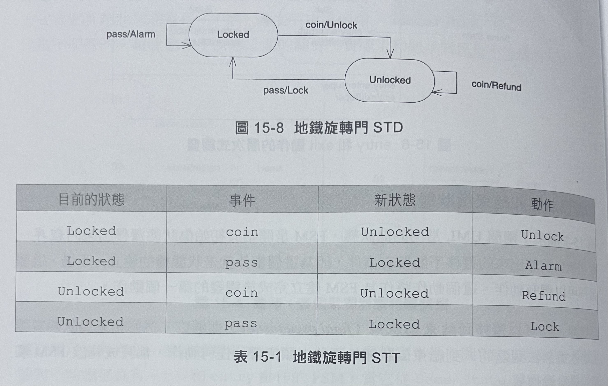

狀態圖 (State Diagram)
======

## 1. 基礎知識

 - 展示一個簡單的狀態遷移圖(STD, state transition diagram)，該圖描繪了控制使用者登入到系統的FSM。
 - 圓角矩形代表狀態，上層為狀態名稱，下層為特定動作
 - 狀態之間包含箭頭的現稱為遷移(transition)，每個遷移都標記觸發該遷移的事件名稱
 - 實心圓為初始偽狀態(initial pseudostate)
 - 在Sending Password Failed狀態外圍畫一個稱為超狀態(superstate)

### 特定事件

- 開始和結束都在相同狀態上的迴圈遷移箭頭
- 自反遷移(reflexive transition)不僅會觸發myAction，還會觸發exit和entry動作

### 超狀態
- 當許多的狀態以相同的方式回應某些相同事件時，使用超狀態非常方便。

- 兩個圖示是等價的

- S3的pause遷移改寫了Cancelable超狀態的預設pause遷移。
- 超狀態更像是基底類別。子狀態能夠用和衍生類別改寫基底類別的方法相同的方式改寫其超狀態的遷移
- 超狀態漢子狀態之間的關係，實際上和繼承關係是不等價的

- 超狀態可以具有和一般狀態相同的entry、exit及特定事件
- 當Some state遷移到Sub狀態時，FSM首先觸發enterSuper，再來觸發enterSub
- 當從Sub2狀態離開時，FSM首先觸發exitSub2，再來觸發exitSuper
- Sub到Sub2的e2遷移僅會觸發exitSub和enterSub2，其未離開超狀態

### 初始偽狀態和結束偽狀態

- 展示了兩個UML常用的偽狀態
- FSM是開始於初始偽狀態遷移出來的程序，從初始偽狀態出來的遷移不能帶有事件，因為這個事件就是狀態機的建立。不過這個遷移可以帶有動作，這個動作將作為FSM建立完成後觸發的第一個動作
- FSM前移到結束偽狀態(final pseudostate)而消亡，這狀態實際是永遠無法到達的。到結束偽狀態的遷移上頭所帶的任何動作都將成為該FSM觸發的最後動作。

## 2. 使用FSM圖示 (finite state machine)
- 此圖是用在理解那些"行為已知的子系統"的狀態機非常有用
- 不過大部分適合以FSM表達的系統，其行為是無法預知的。此圖是不適合用於那些頻繁變化的系統。

- 可以將STD表示成狀態遷移表(STT, state transition Table)表15-1，這表格很容易就能轉換成一個文字檔
- 以這種方式建立和維護FSM比維護圖示容易許多
- SMC (state machine compiler)可讀進STT並產生出實作該邏輯的C++程式(參考www.objectmentor.com)

## 3. 總結
- FSM在組織軟體時是一種強而有力的學說，UML在FSM的視覺化提供豐富的符號。
- 不過，在開發和維護FSM方面，採用文字語言要比圖形更容易一些。