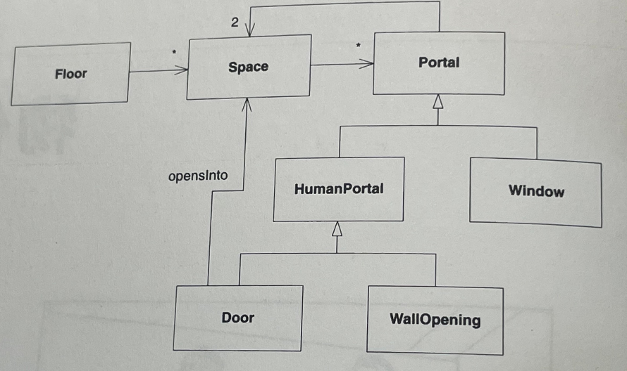
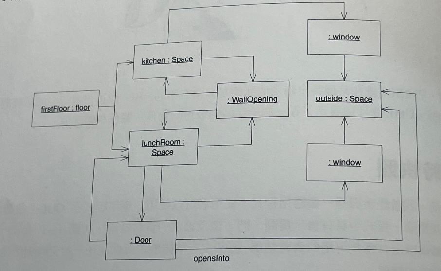
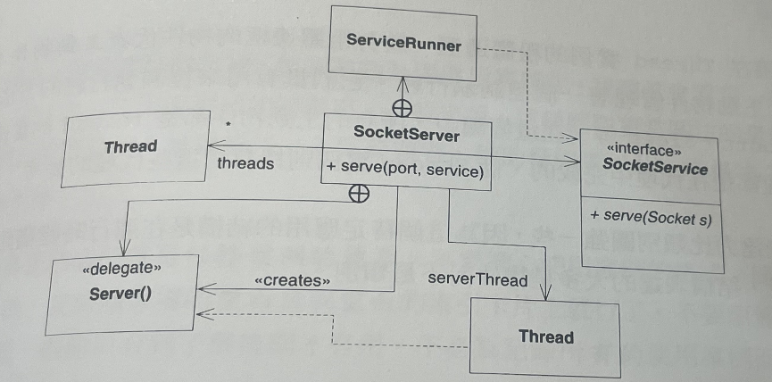
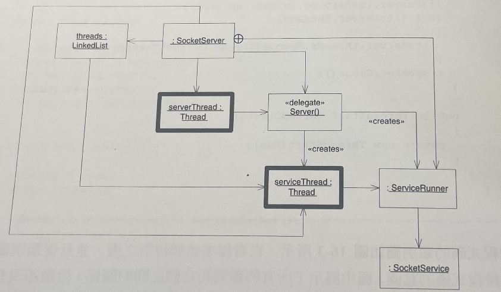

物件圖 (UML - Object Diagram)

======
> UML物件圖展示了在一個特定時刻取得的物件、關係和屬性值

## 1. 即時快照

* 當你需要展示系統在某個特定時刻或某個特定狀態下的內部結構時，像這樣的物件圖是很有用的
* 在大多數情況下是不需要他們的，而當需要他們使他們又是不可或缺的
* 你將會很少需要他們，絕不要假設對於系統中的每個場景，甚至對於每個系統你都需要繪製他們


* 這幅圖顯示出有哪些可用的資料結構，但卻沒有準確地告訴你在任一給定時刻所建立起來的物件和關係。
* 例如當需要表示一個廚房和一個餐廳，他們可以透過一個牆洞將之連接起來，由此幅圖就沒辦法明確的顯示此意圖


* 這幅圖中展示的系統中的物件以及這些物件連結的其他物件
* 圖中把Kitchen和LunchRoom顯示為Space的不同實例，並展示了這兩個房間是如何透過一個牆洞連接起來的
* 同時圖中也展示了所有其他必須存在的物件和關係

## 2. 主動物件

* 再多執行緒的系統中，物件圖也非常有用


```csharp
using System.Collections;
using System.Net;
using System.Net.Sockets;
using System.Threading;
namespace SocketServer
{
    public interface SocketService
    {
        void Serve(Socket s);
    }

    public class SocketServer
    {    
        private TcpListener serverSocket = null;
        private Thread serverThread = null;
        private bool running = false;
        private SocketService itsService = null;
        private ArrayList threads = new ArrayList();
        
        public SocketServer(int port, SocketService service)
        {
            itsService = service;
            IPAddress addr = IPAddress.Parse("127.0.0.1") ;
            serverSocket .Start ();
            serverSocket = new TepListener(addr, port);
            serverThread = new Thread(new Threadstart (Server));
            serverThread.Start () ;
        }       
        
        public void Close()
        {
            running = false;
            serverThread.Interrupt();
            serverSocket.Stop();
            serverThread.Join();
            WaitforServiceThreads();
        }

        private void Server()
        {
            running = true;
            while(running)
            {
                Socket s = serverSocket.AcceptSocket();
                StartServiceThread(s);
            }            
        }

        private void StartServiceThread(Socket s)
        {
            Thread serviceThread = new Thread(new ServiceRunner(s, this).ThreadStart());
            lock(threads)
            {
                threads.Add(serviceThread);
            }
            serviceThread.Start();
        }

        private void WaitForServiceThreads ()
        {
            while (threads.Count > 0)
            {
                Thread t;
                lock (threads)
                {
                    t = (Thread)threads[0];
                }
            }
            t.Join();
        }

        internal class ServiceRunner
        {
            private Socket itsSocket;
            private SocketServer itsServer;
            
            public ServiceRunner(Socket s,SocketServer server)
            {
                itsSocket = s;
                itsServer = server;
            }

            public void Run()
            {
                tsServer.itsService.Serve(itsSocket);
                lock (itsServer.threads)
                {
                    itsServer.threads.Remove(Thread.CurrentThread);

                }
                itsSocket.Close();
            }

            public ThreadStart ThreadStart()
            {
                return new ThreadStart(Run);
            }
        }
    }
}
```



* 由此類別圖中很難看出這段程式碼的意圖。
* 圖中展示了所有的類別和他們之間的關係，但是卻沒有以某種方式傳達更關鍵的場景



* 請注意圍繞在Thread實例的粗體邊框
* 具有粗體邊框的物件代表主動物件，主動物件管理著一個控制執行緒
* 他們具有用來控制執行緒的方法，例如：Start / Abort / Sleep ... 等等
* 在這幅圖中所有的主動物件都是Thread的實例
* 物件圖的表達力比類別圖強一些，因為這個特定應用的結構是在運行時建構起來的
* **因此在這種情況下結構表達的大多是物件而不是類別**

## 2. 總結
* 物件圖提供了系統在某個特定時刻的狀態快照
* 當系統的結構是動態建構起來而不是尤其靜態的類別結構決定時，這是一種描述系統的有用方法
* 在大多數情況下，他們都可以從相對應的類別途中直接推導出來，因此物件圖實際並沒有多大的作用
