物件圖 (UML - Object Diagram)

======
> UN L提供了大量具有吸引力的東西但是使用他們時要保持高度的節制
> 只有當你需要立即向某人解釋一組物件的協作方式，或者當自己想要把這種協作關係視覺化時才使用循序圖
> 把它當作磨練自己分析技能的工具，不要把他們作為必要的文件

## 1. 基礎知識

### 物件、生命線及其他
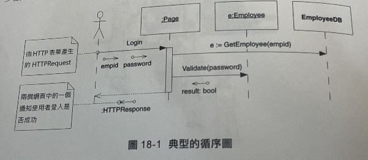
* 圖的頂部顯示了協作中涉及的物件和類別
* 物件的名稱下面有"_"而類別沒有
* 左邊的人行線條圖代表一個匿名物件，他是寫作中來來往往的所有訊息的來源和接收者
* 從物件和參予者垂下來的虛線稱為生命線，每條訊息都標記了訊息的名稱，參數可能會出現在訊息名稱後面的括弧中，時間軸是垂直方向的訊息出現的位置越低，就越晚發送
* Page物件生命線上的在長條小矩形稱為啟動，啟動代表一個函式的執行時間

### 建立和銷毁
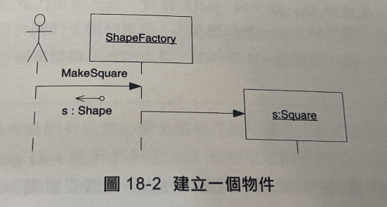

* 在循序途中表示一個物件的建立，是透過一條不帶標記的訊息，這條訊息應該終結在要建立的物件上，而不是其生命線上
* 例如當需要表示一個廚房和一個餐廳，他們可以透過一個牆洞將之連接起來，由此幅圖就沒辦法明確的顯示此意圖

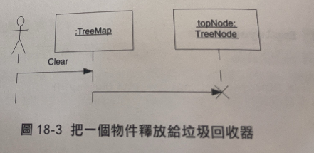
* 要釋放的物件其生命線比正常的短，並且尾部有一個大大的X

### 簡單回圈

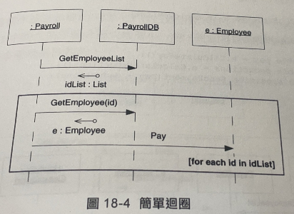
* 將需要重複發送的訊息周圍畫一個框，在該框的某個地方，通常是右下角放置一對［其中包含著回圈條件
* 不要試圖在循序途中表達演算法的細節

### 時機和場合

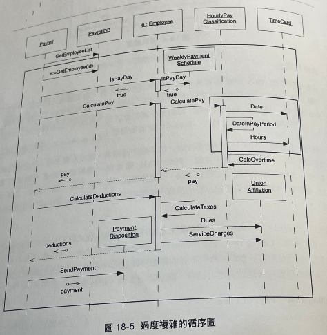
* 不要繪製具有大量物件和訊息的循序圖，這種圖是沒有人能理解也沒有人願意看的
* 請學習如何繪製出那種 紀錄你想做的事情要點而且略小一些的循序圖
* 對於UML圖來說共同點又比差異點來得重要，請把精力集中於此
* 如果真的需要畫一幅循序圖來描繪訊息的流程，請簡潔謹慎的去做
* 將一個大的循序圖分解成幾個小一些，且更加易讀的循序圖
* 當程式碼能夠清楚的表達自己時，圖示就很多餘，是種浪費

## 2. 進階概念

### 迴圈和條件

* 可以繪製出一幅循序圖來完整的說明一個演算法
* 其中包含回圈的符號還有if 語句

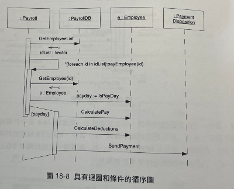
* 使用UML來繪製演算法是非常笨拙的

### 耗費時間的訊息
* 通常我們不會考慮從一個物件像另一個物件發送訊息所花的時間
* 這也是我們以水平線來繪製訊息線的原因
* 但是在某些情況下發送訊息是需要花費時間的，這時可以用有角度的線來描繪他
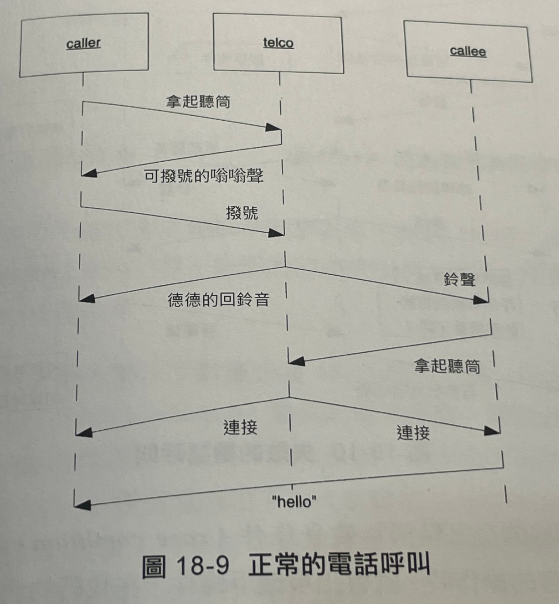

#### 競爭條件

* 當兩個非同步的實體可以同時呼叫不相容的操作時就會出現競爭條件
* 如例子中所提到，當telco呼叫了撥號用的ring操作，而callee卻拿啟了話筒，這時就會出現失敗的電話呼叫
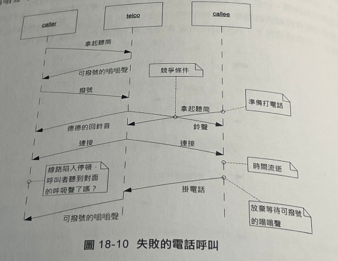

#### 非同步訊息

* 同步訊息
	* 向一個物件發送訊息時，通常要等到接收訊息的物件執行完對應的操作後，發送訊息的物件才會重新獲得控制權。

* 非同步訊息
	* 在分散式或多執行緒系統中，發送訊息的物件可以立即要回控制權，而接收訊息的物件則會在另外一個控制執行緒中執行。
	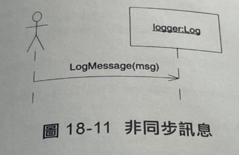

#### 多執行續
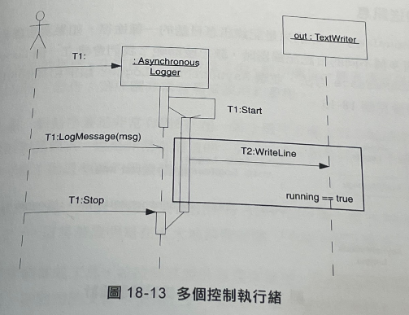

* 非同步訊息隱含著多個控制執行緒
* 我們可以在每個訊息名稱上標記執行緒的識別字，以便在UML圖中展示多個不同的控制執行緒
* 執行緒別字不必對應於程式碼當中的名稱，主要是為圖示服務的

#### 主動物件

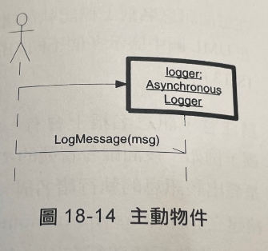

* 想表示一個包含獨立內部執行緒的物件 此物件被稱為主動物件
* 繪製成粗體邊框
* 主動物件實體化並控制自己的執行緒

#### 向介面發送訊息

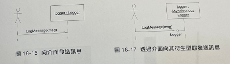

* 想表示某實體物件只是衍生自於某個介面的實作
* 有圖例可知，應用程式使用的僅是Logger介面

## 3. 總結

* 循序圖是一種表達訊息流程的有力武器
* 循序圖非常容易被誤用和濫用
* 請把循序圖當成工具並按照其設計意圖來使用
	* 在白板前使用他們以便即時與他人進行溝通
	* 在簡短的文件中使用他們，以便記錄系統中那些核心、重要的協助
* 就循序圖而言過少要比過多好，可以在之後需要他時，在畫一幅循序圖
