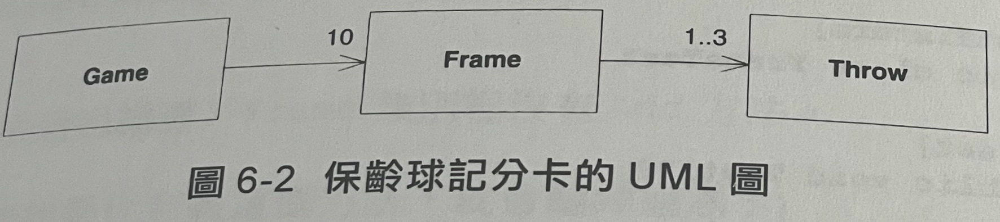

一個真實的程式設計場景
======
> 設計和程式設計都是人的活動，忘記了這一點，就會失去一切。
> 對於設計初期UML圖的看法：「在準備戰役時，我發現計劃本身總是無用的，但是做計劃卻是絕對必要的。」

## 1. 結對程式設計
- 兩人一組，共同討論設計需求
- 提出問題，討論想法，改善架構，重構程式

## 3. 極限程式設計 (XP)
- 將需求定義成數個使用者故事
- 決定使用者故事的開發順序
- 只有在必要的時候才開始建立所需要的程式

## 2. 測試驅動開發
- 定義簡易的測試資料作為驗收測試的案例
- 在建立單元測試時，或許會發現實際上不需要建立(使用)的類別
- 開發順序
	- 在開發實際功能前，先建立單元測試(TestCase)
	- 測試失敗
	- 建立剛好可以通過單元測試的程式碼
	- 測試通過
- 當新的功能開發完成後，確認過去的測試案例，是否有需要保留的必要性

## 3. 系統設計
- 透過UML圖初步定義系統
	- 一場**Game** 由十局的 **Frame**組成，每個Frame 由三次的 **Throw**完成
	
	- 確保設計符合SOLID原則
	- 持續地進行重構