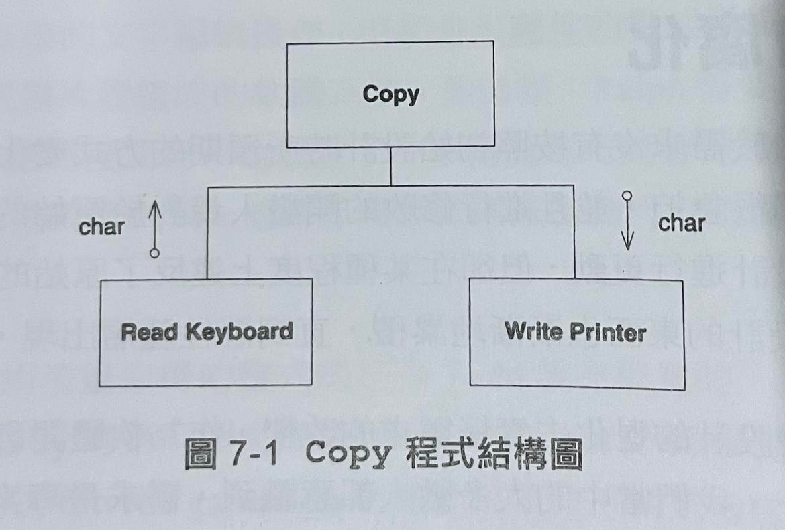

Agile Design
======
> 什麼是敏捷設計
> 實際能滿足工程設標準的軟體說明文件，就只有原始程式碼清單

## 1. 設計臭味 Code Smell

- 設計臭味
	* 僵化性 (Rigidity)
	* 脆弱性 (Fragility)
	* 頑固性 (Immobility)
	* 黏滯性 (Viscosity)
	* 不必要的複雜性 (Needless complexity)
	* 不必要得重複 (Needless repetition)
	* 晦澀姓 (Opacity)
1. 僵化性 (Rigidity)
	* 僵化性指難以對軟體進行修改，如果單一修改會導致有依賴關係的模組有異動，那設計就是僵化的。
2. 脆弱性 (Fragility) - 在進行一個修改時，可能會導致程式的許多地方出現問題。
3. 頑固性 (Immobility) - 設計中包含了對其他系統有用的部分，但是要把這些部分從系統中分離來所需要的努力和風險卻是巨大的。
4. 黏滯性 (Viscosity) - 軟體的黏滯性和環境的黏滯性
	* 當可以保持系統原設計的方式比拼湊方式更難以實現時，就代表原設計有高的黏滯性。我們希望把它設計成面對修改時，仍就容易保持原設計。
5. 不必要的複雜性 (Needless complexity) - 如果設計中包含了目前沒有用處的組成部分，它就含有不必要的複雜性。
6. 不必要得重複 (Needless repetition) - 當同樣的程式碼以些微不同形式一再出現時，就代表開發人員忽略了抽象。發現所有重複並透過適當的抽象去除它們，有助於使系統更容易理解和維護。
7. 晦澀姓 (Opacity) - 指模組難以理解，開發人員必須站在程式閱讀者的角度，努力對程式碼進行重構，使得閱讀者能夠理解程式碼。

## 2. 軟體為何會腐化
- 如果我們的設計由於持續、大量的需求變化而失敗，那就代表我們的設計和實踐本身是有缺陷的。
- 團隊幾乎不進行預先設計，因此，不需要一個成熟的初始設計。反之，他們傾向於讓系統設計盡可能的乾淨和簡單，並使用許多單元測試和驗收程式作為支援。 

## 3. 範例 -Copy程式


Listing 7-1 Copy 程式
```csharp
public class Copier
{
	public static void Copy()
	{
		int c;
		while (c=Keyboard.Read() != -1)
			Printer.Write(c);
	}
}
````

Listing 7-2 Copy 程式第一次修改
```csharp
public class Copier
{
	public static bool ptFlag = false;
	public static void Copy()
	{
		int c;
		while (c=(ptFlag ? PaperTape.Read() : Keyboard.Read()) != -1)
			Printer.Write(c);
	}
}
````
Listing 7-3 Copy 程式第二次修改
```csharp
public class Copier
{
	public static bool ptFlag = false;
	public static bool punchFlag = false;
	public static void Copy()
	{
		int c;
		while (c=(ptFlag ? PaperTape.Read() : Keyboard.Read()) != -1)
			punchFlag ? PaperTape.Punch(c) : Printer.Write(c);
	}
}
````

Listing 7-4 Copy 程式敏捷版本
```csharp
public interface Reader
{
	int Read();
}
public class KeyboardReader : Reader
{
	public int Read() { return Keyboard.Read();}
}
public class Copier
{
	public static Reader reader = new KeyboardReader();
	public static void Copy()
	{
		int c;
		while ((c=reader.Read()) != -1)
			Printer.Write(c);
	}
}
````

- 敏捷開發人員遵循了以下的步驟
1. 他們遵循敏捷實踐去發現問題
2. 它們應用設計原則(Principle)去診斷問題
3. 它們應用適當的設計模式(Design Pattern)去解決問題

## 4. 總結
* 敏捷設計是一個過程(process)，不是事件(event)。它是一個持續應用原則、模式及實踐，來改進軟體結構和可讀性。它致力保持系統設計在任何時間都盡可能地簡單、乾淨並富有表達力。