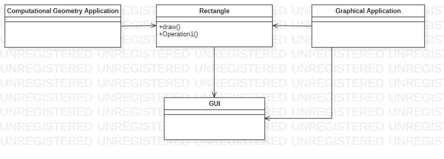
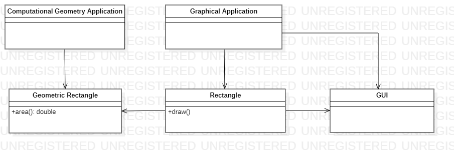
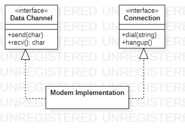
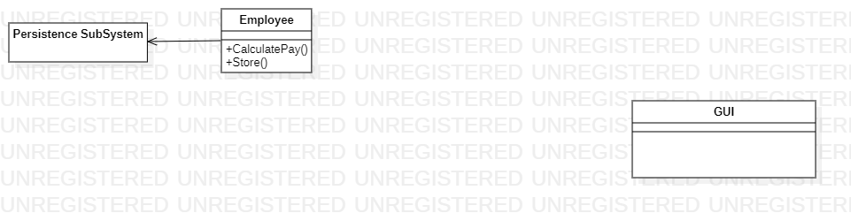

Singel Responsibility Principle
======
> 單一職責原則
> 一個類別應該只有一個發生變化的原因

## 1. 範例說明

- Rectangle 具有兩個方法，分別負擔以下兩個工作
	* draw(): 把舉行繪製在螢幕上
	* area(): 計算矩形的面積
- 有兩個不同的應用程式會使用到Rectangle類別

- 這個設計違反了單一職責原則，不同的職責建立在同一個類別中。
- 導致了設計上的耦合，在未來修改或維護時，可能會導致不可預期的方式失敗。

- 將職責分離到兩個不同的類別中，不同的功能間不再互相影響

## 2. 定義職責
* 可將職責是為 **變化的原因**
* 有多於一個的動機去改變一個類別，那麼這個類別就有多於一個的職責
* 若是城市的變化方式總是導致這兩個職責的變化，則不需要去分離，分離容易產生**不必要的複雜性**臭味

## 3. 分離耦合的職責
* 如上述Modem 類別的例子，已經透過解偶合的方式執行分離介面，已不會對其他部分的程式造成汙染

## 4. 持久化 (Persistence)

* Employee 類別包含了業務規則與對於持久化的控制
* 業務規則往往會頻繁變化，而持久化的方式通常不會頻繁變化
* 大多數情況，絕不該混合在一起
* 透過TDD的開發模式，可以在設計出現臭味之前，就迫使我們分離這兩個職責
* 可以使用FACADE(外觀模式)、DAO(資料存取物件)、Proxy(代理模式) 進行重構，來分離這兩個職責

## 4. 總結
* SRP 是所有原則中最簡單的原則之一，也是最難正確運用的原則之一。我們會很自然地就把職責結合在一起。軟體設計真正要做的許多工作，就是發現職責。並把那些職責相互分離。事實上，我們將要論述的其他原則，都會以這樣或那樣的方式回到這個問題上。
