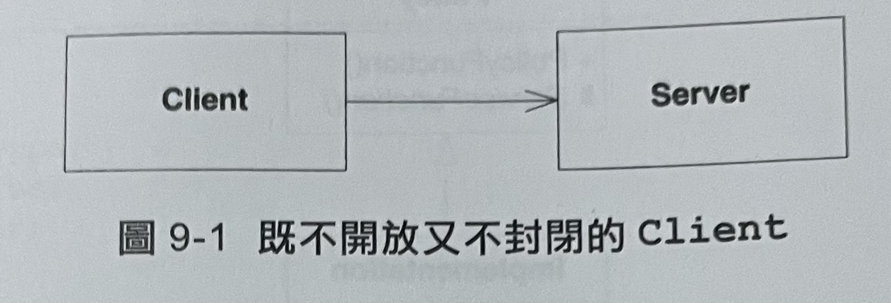
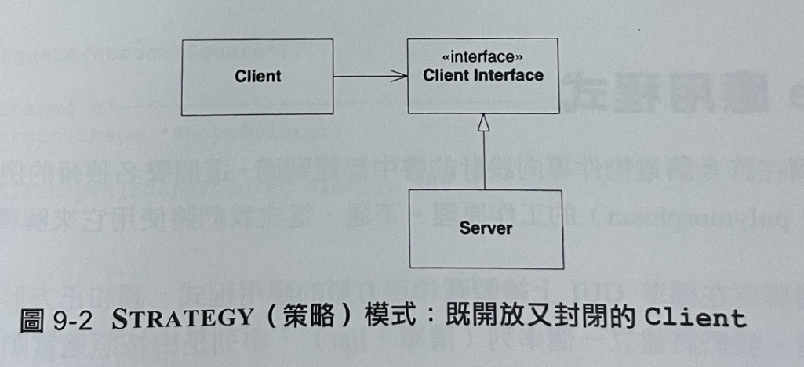
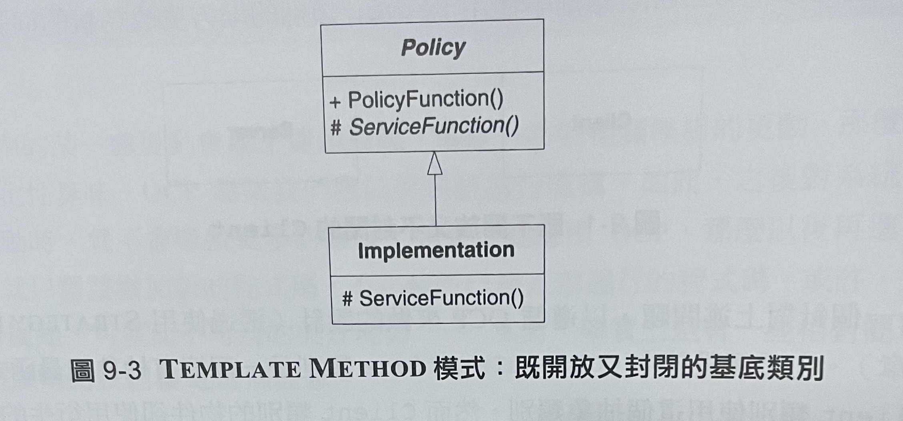
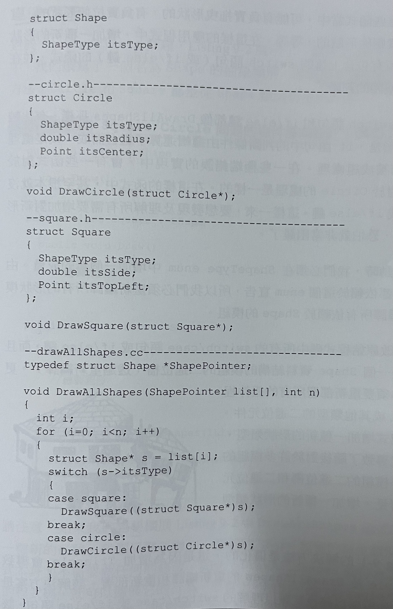

OCP (The Open-Closed Principle) : 開放-封閉原則
======
> 軟體實體(類別、模組、函式等等)應該是可擴展的，但不可修改。

## 1. OCP概述

1. 對於擴展式開放的(open for extension)。
這意味著模組的行為式可擴展的。當應用的需求改變時，我們可以對模組進行擴展，使其具有那些滿足改變的新行為。換句話說，我們可以改變模組的功能。
2. 對於修改式封閉的(closed for modification)
對模組行為進行擴展時，不必要動模組的原始程式碼或二進位碼。模組的二進位可執行版本，無論是可連結的程式庫、DLL或.EXE檔，都無須更動。

* 如何才能使【不變更動模組原始程式碼但改變它的行為】成為可能?
答案就是抽象 (abstruction)







## 2. Shape應用程式

Listing 9-1 Square/Circle問題的程式化解決方案


* 違反OCP
DrawAllShapes函式不符合OCP，因為他對於加入新的形狀型態並非封閉的。每增加一種新的形狀型態，都必須更改這個函式。


Listing 9-2 Square/Circle問題的物件導向設計(OOD)解決方案
* 遵循OCP
展示一個符合OCP的解決方案。在這個方案中，我們撰寫了一個名為Shape的抽象類別。這個抽象類別僅有一個名為Draw的抽象方法。

```csharp
public interface Shape
{
    void Draw();
}

public class Square : Shape
{
    public void Draw()
    {
        //繪製正方形
    }
}

public class Circle : Shape
{
    public void Draw()
    {
        //繪製圓形
    }
}

public void DrawAllShapes(IList shapes)
{
    foreach (Shape shape in shapes)
        shap.Draw();
}
```


Q: 如果我們要求所有的Circle必須在Square之前繪製?
那麼Listing 9-2當中的DarwAllShapes函式無法對這種變化達到封閉效果。我們必須修改DarwAllShapes的實作，使他先掃描串列中所有的Circle，然後再掃描所有的Square。

* 使用抽象獲得顯式封閉
IComparable介面只有一個方法:CompareTo

Listing 9-3 繼承了IComparable介面的Shape

```csharp
public interface Shape : IComparable
{
    void Draw();
}
```

Listing 9-4 依序繪製的DrawAllShapes函式

```csharp
public void DrawAllShapes(ArralList shapes)
{
    shapes.Sort();
    foreach (Shape shape in shapes)
        shap.Draw();
}
```

Listing 9-5 對Circle排序

```csharp
public class Circle : Shape
{
    public int CompareTo(object o)
    {
        if (o is Square)
            return -1;
        else
            return 0;
    }
}
```

顯然這函式以及所有Shape的衍生類別中的CompareTo函式都不符合OCP。每次建立一個新的Shape的衍生類別時，所有的CompareTo()函式都需要修改。

* 使用【資料驅動】的方式獲取封閉性
    如果我們要使Shape的各個衍生類別間互不知曉，可以採用表格驅動的解決方案。

Listing 9-6 表格驅動的形狀類別排序機制

```csharp
///<sumaary>
/// 這個比較程式用於從priorities hastable中，搜尋某種形狀
/// priorities table定義了形狀的先後次序。位找到的形狀優先於找得到的形狀。
///<summary>
public class ShapeComparer : IComparer
{
    private static Hashtable priorities = new Hashtable();

    static ShapeComparer()
    {
        priorities.Add(typeof(Circle), 1);
        priorities.Add(typeof(Square), 2);
    }

    private int PriorityFor(Type type)
    {
        if(priorities.Contains(type))
            return (int)priorities[type];
        else
            return 0;
    }

    public int Compare(object o1, object o2)
    {
        int priority1 = PriorityFor(o1.GetType());
        int priority2 = PriorityFor(o2.GetType());
        return priority1.CompareTo(priority2);
    }
}

public void DrawAllShapes(IList shapes)
{
    shapes.Sort(new ShapeComparer());
    foreach (Shape shape in shapes)
        shap.Draw();
}
```
	
## 3. 總結

* 就許多方便來說，物件導向設計的核心之一就是OCP
* 遵循這個原則可以帶來好處:也就是靈活性、再使用性及維護性
* 【拒絕不成熟的抽象】和抽象本身一樣重要
